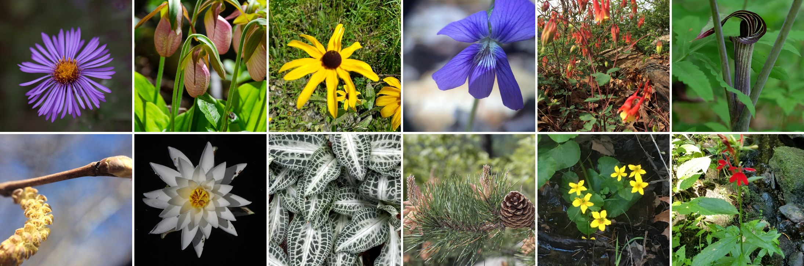

# plant-pics

Builds image datasets of plants from the [iNaturalist open data](https://github.com/inaturalist/inaturalist-open-data)
archive. It filters the archive's metadata down to plant photos from one
region, downloads the images, labels them with a vision-language model to
separate photos of plants in nature from the rest, and publishes the results
to the Hugging Face Hub. A ViT classifier can then be trained on the labelled
photos.

The filter defaults to a New England bounding box, but nothing in the pipeline
is region-specific. The New England run produced two datasets:

- [blambert/ne_plant_classes](https://huggingface.co/datasets/blambert/ne_plant_classes) -
  every photo, labelled nature / human / magnified / manmade / other
- [blambert/ne_plant_photos](https://huggingface.co/datasets/blambert/ne_plant_photos) -
  the `nature` photos, with taxon and observation metadata

The photos shown here are all CC0. `images/` also holds the pictures the
dataset cards use.

## Pipeline

`build-dataset.sh` runs the whole sequence. The steps are:

1. **Download the metadata.** The archive lives in a public S3 bucket and is
   refreshed monthly:

        aws s3 cp s3://inaturalist-open-data/taxa.csv.gz data/ --no-sign-request
        aws s3 cp s3://inaturalist-open-data/observations.csv.gz data/ --no-sign-request
        aws s3 cp s3://inaturalist-open-data/photos.csv.gz data/ --no-sign-request

2. **Filter to plants inside the bounding box:**

        uv run plant-filter data --out-prefix ne \
            --lat-min 41 --lat-max 48 --lon-min -74 --lon-max -67

   `data` is the directory holding the downloaded `*.csv.gz` files; the filter
   writes `<prefix>_taxa.tsv` and `<prefix>_pics.tsv` back into it, so the call
   above produces `data/ne_taxa.tsv` and `data/ne_pics.tsv`. The prefix defaults
   to `plant`. `_pics.tsv` is one row per photo; `_taxa.tsv` is one row per
   species those photos cover, most commonly observed first. Both carry an
   `observations` column counting the species' matching observations before
   `--max-per-species` caps the photos kept.

3. **Download the images:**

        uv run plant-download data/ne_pics.tsv

4. **Annotate them** with `vlm-toolkit`, which sorts each photo into nature /
   human / magnified / manmade / other:

        uv run vlm process ./large \
            --prompt-file ./prompts/inat_classify.txt \
            --model Qwen/Qwen3.5-9B \
            --output ne_plant_classes.jsonl

5. **Publish the labelled photos** as their own dataset:

        uv run vlm upload-dataset ne_plant_classes.jsonl blambert/ne_plant_classes \
            --card cards/ne_plant_classes.md

6. **Package the `nature` photos into a dataset:**

        uv run plant-build-dataset ne_plant_classes.jsonl data/ne_pics.tsv \
            --target blambert/ne_plant_photos --card cards/ne_plant_photos.md

   Takes the `vlm process` output, keeps the images it labelled `nature`
   (`--label` picks a different class), joins each one to its row in the filter
   output on the photo id its filename carries, and pushes the result to the
   Hub. `data/ne_pics.tsv` is the only metadata source, so anything the dataset
   should carry belongs in the filter's `PIC_COLUMNS`.

## Other Commands

- **Look up common names** for every species in a filter output's `name`
  column with Claude Haiku, writing them to a TSV (needs `ANTHROPIC_API_KEY`):

        uv run plant-extract-common-names data/ne_taxa.tsv -o data/common_names.tsv

- **Train a classifier** on a labelled Hub dataset (defaults to
  `blambert/ne_plant_classes`), logging to Weights & Biases unless `--no-wandb`.
  See [Training a Classifier](#training-a-classifier).

## Training a Classifier

`plant-train-classifier` fine-tunes a pretrained image model to reproduce the
VLM's labels, so new photos can be sorted without running the VLM:

    uv run plant-train-classifier \
        -o models/ne_plant_classes_vit --push-to blambert/ne_plant_classes_vit

- **Data.** Labels with fewer than 100 examples are dropped (`--min-class-size`),
  which removes `other`. The rest is split 60% train / 20% validation / 20%
  test, stratified by label. `--limit` trains on a sample for a quick check.
- **Preprocessing.** Photos are resized whole to the model's input size, never
  cropped, because what decides a label - a ruler, a hand - is often near the
  edge of the frame. Training adds a random horizontal flip.
- **Speed.** Defaults are 4 epochs at batch size 256 and learning rate 8e-5;
  the first full run peaked at epoch 3 of 10. On CUDA the model is compiled
  with `torch.compile`, which `--no-compile` skips if it fails to build.
- **Checkpoints.** The validation split is scored once per epoch and the
  checkpoint with the best macro F1 is kept; accuracy would reward always
  predicting `nature`. Only the best and latest checkpoints stay on disk.
- **Results.** The best checkpoint is scored on the test split, writing
  `test_results.json` and `test_per_label.json` (per-label scores and a
  confusion matrix) to the output directory.
- **Weights & Biases.** Runs log to the `inat-vit-classifier` project unless
  `--no-wandb` is passed: training loss, overall and per-label validation
  scores, and a test summary with a per-label table and confusion matrix. The
  `test/errors` table holds every misclassified test photo, most confident
  first, with its true and predicted labels and an iNaturalist link; confident
  mistakes are often wrong VLM labels rather than model errors.
- **Publishing.** `--push-to <repo>` uploads the model and its image processor
  once training finishes, with `--card` supplying the model card. The Hub login
  is checked before training starts.

Pick the base model with `-m`. The script supports models whose image processor
resizes to a fixed height and width, which covers the ViT and SigLIP families:

| Model                                | Params | Notes                                                         |
| ------------------------------------ | ------ | ------------------------------------------------------------- |
| `google/siglip2-base-patch16-224`    | 93M    | Recommended; image-text pretraining knows hands, rulers, labs |
| `google/siglip2-so400m-patch14-224`  | 400M   | Stronger SigLIP 2, several times slower to train              |
| `google/vit-base-patch16-224-in21k`  | 86M    | The default; a solid, well-understood baseline                |
| `google/vit-large-patch16-224-in21k` | 304M   | Larger ViT, if the base model underfits                       |

Labels come from the VLM rather than people, so every model is capped by how
often the VLM was right; the base model matters most for the small `manmade`
and `magnified` classes.

## Prompts

`prompts/` holds the VLM prompts the annotation step runs, copied out of
`vlm-toolkit` so they can be edited here:

- `prompts/inat_classify.txt` - sorts a photo into nature / human / magnified /
  manmade / other

## Cards

`cards/` holds one card per dataset or model produced here, named after the
Hub repo:

- `cards/ne_plant_classes.md` - photographs labelled by subject kind
- `cards/ne_plant_photos.md` - the `nature` photos, with taxon and observation metadata
- `cards/ne_plant_classes_vit.md` - the classifier trained on `ne_plant_classes`

Each card is uploaded to the Hugging Face Hub as that repo's `README.md`,
which is why the files carry Hub YAML frontmatter.

## Development

`uv sync` installs the dev group (black, isort) alongside the project. CI runs
both on `src/` for pushes and pull requests against `main`:

    uv run black src/
    uv run isort src/

## Notes

### Archive Size

As of 1/1/2026:

| File                | Rows        |
| ------------------- | ----------- |
| taxa.csv.gz         | 1,615,611   |
| observations.csv.gz | 226,862,366 |
| photos.csv.gz       | 401,313,288 |

416,341 of the taxa rows are plants.

Peek at the raw data without decompressing:

    gzcat taxa.csv.gz | less

### Plant Taxonomy

Taxon 48460 is the root of the tree and 47126 is the Plantae kingdom, so every
plant's ancestry string starts with `48460/47126/`:

    47126	48460	70	kingdom	Plantae	true
